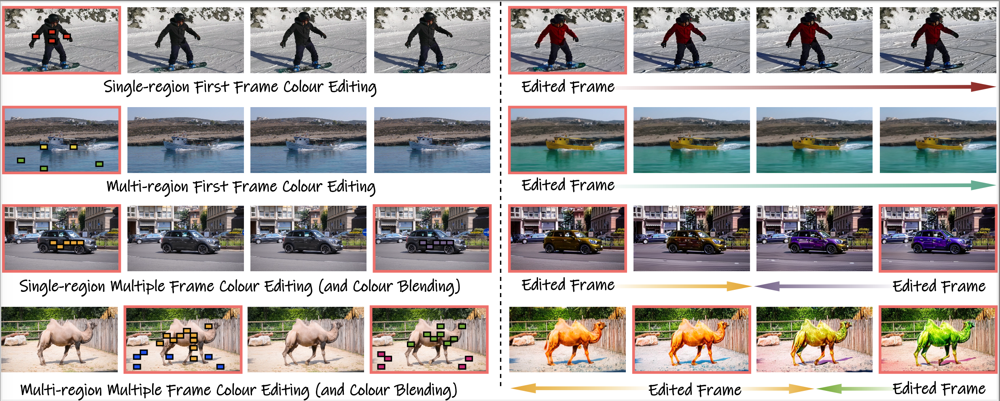

# DreamColour

[](https://arxiv.org/abs/2412.05180) [](https://chaitron.github.io/DreamColour-demo)

Official repo for [DreamColour: Controllable Video Colour Editing without Training](https://arxiv.org/abs/2412.05180).



## TODO
- [ ] Release inference code.
- [ ] Release GUI version.

## Citation
If you find the repo useful, please consider citing:
```
@article{utintu2024dreamcolour,
  author    = {Chaitat Utintu and Pinaki Nath Chowdhury and Aneeshan Sain and Subhadeep Koley and Ayan Kumar Bhunia and Yi-Zhe Song},
  title     = {DreamColour: Controllable Video Colour Editing without Training},
  journal   = {arXiv preprint arXiv:2412.05180},
  year      = {2024},
}
```

